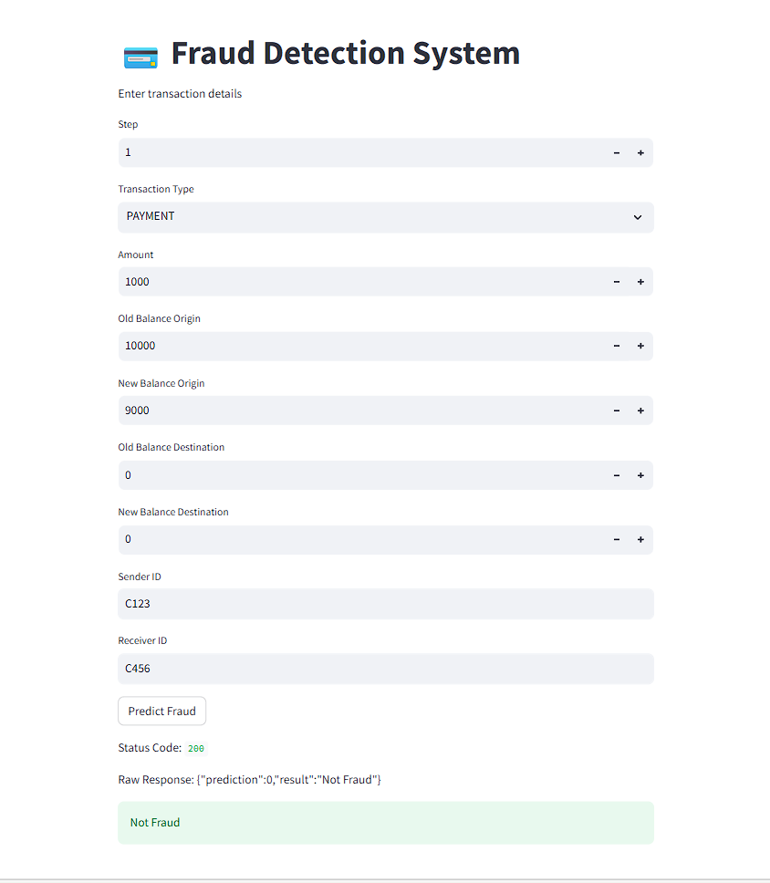

💳 Fraud Detection System

* An end-to-end machine learning system that detects fraudulent financial transactions.

* The model is deployed using FastAPI for backend inference, Streamlit for UI, and Docker for containerized deployment.

🚀 Project Overview

* Financial fraud detection is a critical problem in digital payments.

* This project builds a machine learning pipeline that predicts whether a transaction is fraudulent.

* Users enter transaction details through a Streamlit web interface, which sends the data to a FastAPI backend API that performs prediction using a trained Random Forest model.

🛠️ Tech Stack

* Programming	- Python

* Machine Learning	- Scikit-learn

* Data Handling	- Pandas, NumPy

* API Framework -	FastAPI

* UI -	Streamlit

* Containerization -	Docker

* Imbalanced Data -	SMOTE

🧠 Machine Learning Pipeline

      Raw Transaction Data
          
           ↓
     Feature Engineering

     
           ↓
    ColumnTransformer(StandardScaler + OneHotEncoder)

        
           ↓
    SMOTE Oversampling
    
           ↓
    Random Forest Classifier
    
[Key techniques used:]

* Feature engineering

* Class imbalance handling (SMOTE)

* Pipeline-based training

* Random Forest classification

🏗️ System Architecture

          User
          
           ↓
     Streamlit UI
     
           ↓
        FastAPI
        
           ↓
    ML Prediction API
    
           ↓
    Scikit-learn Pipeline
   
           ↓
     Fraud Prediction

📂 Project Structure

Fraud_Detection_SMOTE

│

├── api.py                 # FastAPI backend

├── streamlit_app.py       # Streamlit UI

├── feature_engineering.py # Feature transformations

├── fraud_pipeline.pkl     # Trained ML pipeline

│

├── images

├── docker-compose.yml     # Multi-container setup

├── Dockerfile             # Container configuration

├── requirements.txt       # Dependencies

│

├── train_model.py         # Model training script

└── README.md

⚙️ Installation

Clone the repository:

* git clone https://github.com/yourusername/fraud-detection-system.git

* cd fraud-detection-system

Install dependencies:

* pip install -r requirements.txt

🐳 Run with Docker

* Build and run the project using Docker  (docker compose up --build)

🌐 Application Access

Streamlit UI	http://localhost:8501

FastAPI API Docs	http://localhost:8000/docs

📊 Example Prediction Request

API Endpoint:

* POST /predict

Example input:

> {

 "step": 1,
 
 "type": "PAYMENT",
 
 "amount": 1000,
 
 "nameOrig": "C123",
 
 "oldbalanceOrg": 10000,
 
 "newbalanceOrig": 9000,
 
 "nameDest": "C456",
 
 "oldbalanceDest": 0,
 
 "newbalanceDest": 0
 
> }

Example response:

> {

 "prediction": 0,
 
 "result": "Not Fraud"
 
> }

}

📈 Model Evaluation

The model is evaluated using:

* Precision

* Recall

* F1-score

* Accuracy

* Class imbalance is handled using SMOTE oversampling to improve fraud detection.

📸 Demo Screenshots

📌 Key Learning Outcomes

* Building production-ready ML pipelines

* Deploying ML models with FastAPI

* Creating interactive ML applications using Streamlit

* Containerizing ML applications using Docker

* Handling imbalanced datasets using SMOTE

🔮 Future Improvements

* Deploy to AWS / GCP

* Add CI/CD pipelines

* Implement model monitoring

* Use MLflow for experiment tracking

* Add database for transaction logging

👨‍💻 Author

Sudheer Putta

Machine Learning Enthusiast

Data Science & AI

   

    
